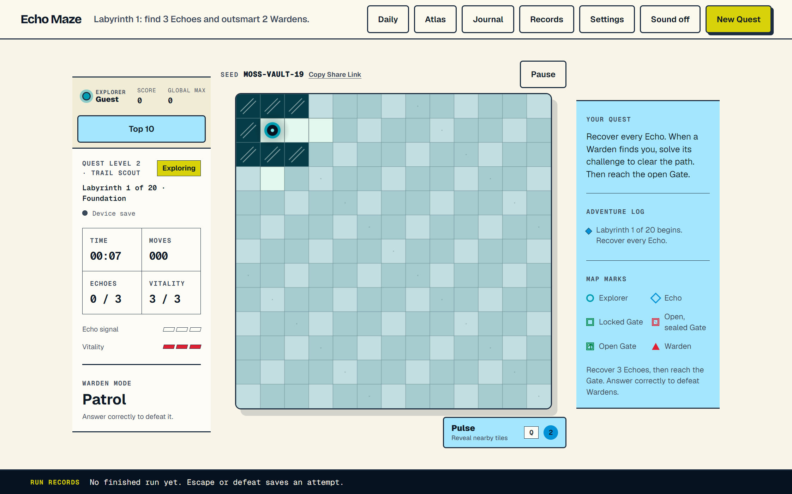

# Echo Maze

*A kid-friendly learning adventure inside a deterministic browser maze — recover every Echo, outsmart Wardens with knowledge, then find the Gate.*

## What it does

Echo Maze is a browser maze game that turns learning questions into gameplay.
Players explore a seeded, deterministic Labyrinth, recover Echoes, and are
challenged by Wardens: answering a curriculum question correctly defeats the
Warden, answering wrong costs Vitality. Questions come from an LLM (Ollama
locally, Gemini in production) validated against reviewed curriculum cards,
with a bundled deterministic deck as the always-available fallback.

## Features

- Three Quest Levels (Bright Start, Trail Scout, Maze Master) across 20 Labyrinths each, with scaling mazes, Echoes, and Wardens
- Deterministic seeded generation — share links reproduce the exact maze
- Readable Warden AI that Patrols objectives, Hunts nearby Explorers, and Intercepts predictable movement
- Server-validated LLM questions with child-safety checks and a reviewed fallback deck
- Daily shared Labyrinth (one deterministic casual maze per UTC date), Echo Atlas progression map, and a practice Journal
- Optional Clerk sign-in with boundary-only cloud Quest sync, conflict recovery, and a global Top-10 scoreboard
- One-time Stripe Lifetime Membership gating Run access server-side (guest and free signed-in runs included)
- Accessibility settings: fog contrast, larger marks, reader-friendly question text, reduced effects, touch/swipe controls

## How it works

The Vite front end renders the maze on a Canvas from pure, deterministic game
rules in `src/game/`. An Express server (local dev and `api/` serverless
functions on Vercel) owns question generation, run admission, scores, and
payments, backed by Neon PostgreSQL — the browser never holds secrets or
authoritative state. Game-rule decisions are recorded in `docs/adr/`.

## Tech stack

Vanilla JavaScript (ES modules, strict `tsc` checking) · Canvas · Vite · Express 5 · PostgreSQL (Neon) · Clerk · Stripe · Vitest · Playwright

Setup instructions: see [docs/SETUP.md](docs/SETUP.md)

The original project is preserved at [tomnguyen103/Maze](https://github.com/tomnguyen103/Maze).
