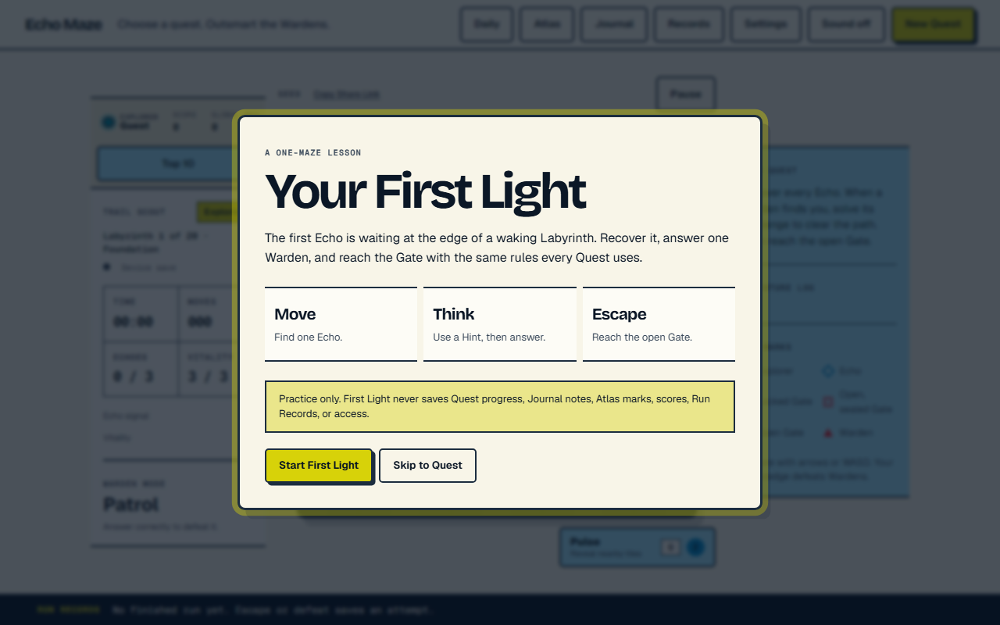
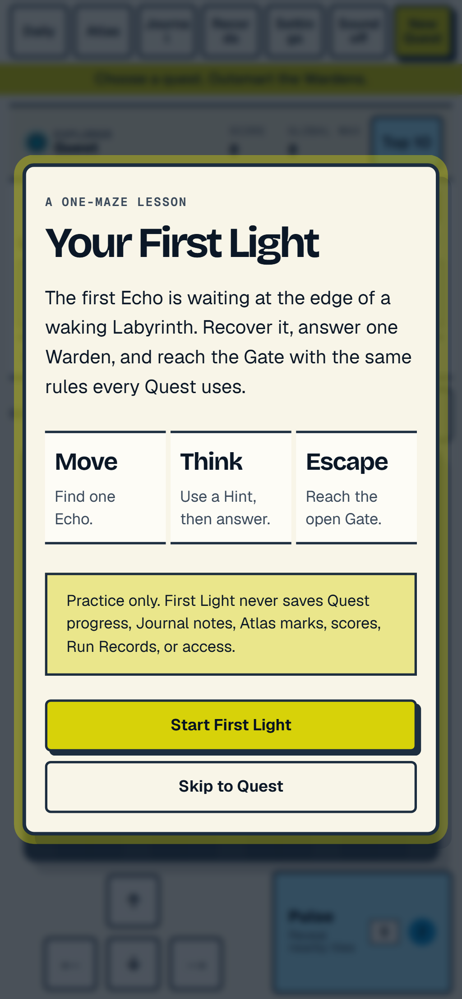
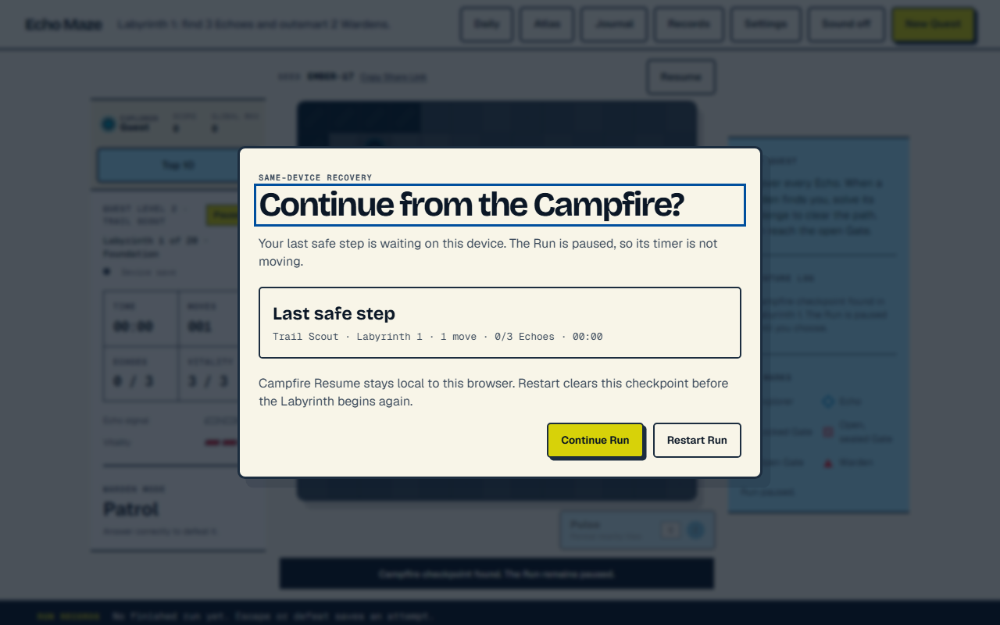
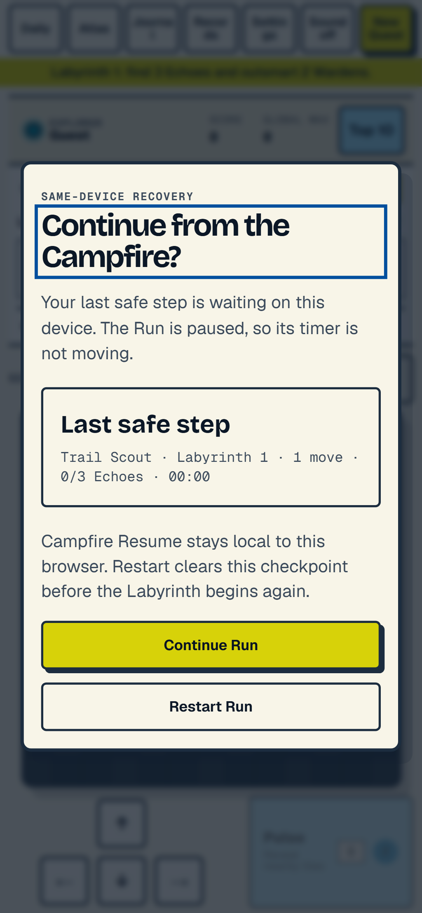

# Milestone 1 first-player checkpoint

**Status:** Script ready; moderated sessions not yet run

**Parent spec:** GitHub issue #95

**Human evidence ticket:** GitHub issue #101
**Baseline code:** `1313fc830979958467090bc97b22580969e2910c`

## Automated Milestone 1 readiness

**Status:** Pass on 2026-07-29 for issue #100

This is automated product evidence, not a substitute for the moderated
observations below. Playwright verified the semantic screen-reader contract
(names, descriptions, live status, dialog focus, action order, and return
focus). No claim is made that a real assistive-technology session has already
run; named screen-reader use remains valid human evidence for issue #101.

### Release journeys

| Contract | Automated evidence |
|---|---|
| First choice | Start First Light and Skip to Quest are named, focused, keyboard reachable, and at least 44 by 44 pixels. |
| First Light | Replay, correct completion, normal defeat, free retry, Quest handoff, Reduced Motion, 200-percent text, keyboard, and touch paths pass. |
| Isolation | First Light creates no Active Run Recovery at start, after movement, during a Warden Challenge, after defeat, after retry, or after completion. Refresh never opens Campfire Resume for First Light. |
| Campfire Resume | A normal Quest movement creates a checkpoint; refresh pauses behind Continue and Restart; Continue restores the maze; Restart clears the checkpoint and restarts at zero moves. |
| Terminal cleanup | Escape and defeat remove recovery before reload and do not duplicate Records, Quest progress, scores, or learning writes. |
| Recovery failures | Denied storage, corrupt JSON, deletion denial, and a payload over 256 KiB use child-safe copy, expose no raw error, and keep current-tab play available. |
| Exact Challenge recovery | Loading, wrong-answer feedback, replacement loading, exact accepted Reviewed Question Revision, Hint state, selected option IDs, vitality, Gate state, sign-out cleanup, defeat cleanup, and reload idempotency pass. |
| Runtime quality | Focused Milestone 1 journeys emit no unhandled page error, console error or warning, or raw provider/storage error. |
| Responsive access | First Light and Campfire actions stay single-line and at least 44 by 44 pixels at 320, 375, 390, 414, and 768 CSS pixels; desktop is checked at 1280 by 800. The exact 390 by 844 mobile state and 200-percent text have no horizontal page or dialog overflow. |

The integrated proof lives in
`tests/e2e/milestone-1.spec.js`. Existing focused evidence remains in
`tests/e2e/entry.spec.js`, `tests/e2e/game.spec.js`, and
`tests/active-run-recovery.test.js`.

### Local release gate

| Gate | Result |
|---|---|
| `npm run lint` | Pass |
| `npm run typecheck` | Pass |
| `npm run test` | Pass: 108 files passed, 7 intentionally skipped; 965 tests passed, 16 intentionally skipped |
| `npm run build` | Pass |
| `npm run check:bundle` | Pass with every recorded ceiling unchanged |
| `npx playwright test` after the E2E build | Pass: 168 passed, 14 deterministically skipped, 182 desktop/mobile cases total |
| Vercel functions | No function added |

Recorded production bundle measurements:

| Surface | Measured gzip | Ceiling |
|---|---:|---:|
| Landing JavaScript | 7.60 KB | 8 KB |
| Gameplay JavaScript | 27.06 KB | 30 KB |
| Campfire Resume JavaScript | 3.20 KB | 5 KB |
| Shared styles | 10.76 KB | 12 KB |
| Optional Clerk identity | 544.21 KB | 600 KB |
| Admin JavaScript | 5.78 KB | 20 KB |
| Optional Sentry | Not built; DSN unset | 120 KB |

### Hallmark 58-gate record

Audit inputs were the locked `design.md`, `tokens.css`,
`src/daylight.css`, the rendered desktop/mobile states below, and the
responsive Playwright measurements. Because Echo Maze is managed by
`design.md`, repeated Workbench and Focused Encounter structures are required
system consistency, not variety drift.

**Pre-emit critique:** Philosophy 5; Hierarchy 5; Execution 5; Specificity 5;
Restraint 5; Variety 4. No axis required a revision.

| Gates | Result | Evidence |
|---:|---|---|
| 1-7 | Pass | Bricolage/Geist roles, no gradient text, no icon-card template, no nested cards or decorative side stripes, no generic centered hero, and warm tokenized paper rather than pure black/white bases. |
| 8-9 | Pass | Locked Workbench/Focused Encounter structure has deliberate rules, tint changes, and uneven functional rhythm; no Hero-3-cards-CTA-footer template. |
| 10-19 | Pass | No transition-all, uniform hover scaling, bounce easing, layout-property motion, fading focus ring, redundant success toast, auto-rotation, or placeholder-brand copy. |
| 20-21 | Pass | The CSS carries the truthful Hallmark/design-system stamp; no Specimen fallback. |
| 22-27 | Pass | Tinted neutrals, restrained signal footprint, token spacing, readable measure, complete native button states, and global Reduced Motion coverage. |
| 28-29 | Not applicable | No video or abstract hero background is present in either release dialog. |
| 30 | Pass | No mixed icon libraries or emoji value-prop icons. |
| 31-32 | Not applicable | No Lottie enrichment and no new repeated-archetype design run. |
| 33-38a | Pass | Canvas/decorative semantics are explicit, both page roots clip horizontal overflow, mixed-height action rows center correctly, only the locked three type roles appear, and headings remain upright. |
| 39 | Not applicable | These release dialogs contain no input, textarea, or select field. |
| 40-41 | Pass | Ink, muted ink, focus blue, electric-pear button fill, and accent ink remain readable on their computed surfaces; the primary action uses the dedicated accent-ink token. |
| 42-43 | Pass | N7 compact game controls and the Ft8 record strip avoid generic marketing navigation/footer fingerprints. |
| 44 | Not applicable | No marketing hero was emitted; the equivalent release choice content fits the tested desktop/mobile dialog viewport. |
| 45-49 | Pass | Every ornament is game-semantic, no metric is invented, no fake browser/device chrome exists, colors/fonts stay tokenized, and clickable labels remain single-line. |
| 50 | Not applicable | Neither release dialog contains an image-bearing grid. |
| 51 | Pass | Display headings use long-word wrapping and zero minimum width. |
| 52-53 | Not applicable | No per-theme split section head or CSS radio-tab pattern exists. |
| 54-55 | Pass | Labels stack above headings, and no all-caps display heading uses a sub-1.0 line height. |
| 56-57 | Not applicable | No secondary sticky-at-zero element and no new studied-DNA build; the locked `design.md` remains authoritative. |

**Hallmark result:** 58 of 58 pass or correctly not applicable.

**Finding count:** 0 critical; 0 major; 0 minor.

### Recorded browser states

First Light, desktop 1280 by 800:

First Light, mobile 390 by 844:

Campfire Resume, desktop 1280 by 800:

Campfire Resume, mobile 390 by 844:

## Decision card

| Field | Contract |
|---|---|
| Baseline source | Moderated first-time use on the locally validated Milestone 1 build |
| Primary outcome | A first-time supervised player completes First Light without an adult taking control and understands the Warden/Vitality rule |
| Counter-metric | Skip to Quest, normal Quest entry, and Campfire Resume remain findable without added first-run overload |
| Provisional target | At least 80% complete without adult control and can explain “correct defeats the Warden; wrong costs Vitality” |
| Review window | After automated Milestone 1 validation and before Milestone 2 production starts |
| Decision threshold | Tune until acceptable; evidence may change presentation and pacing but cannot cancel First Light |

## Privacy boundary

Record behavior, not identity.

- Do not record a name, username, email, school, age, account identifier, face,
  voice, screen video, or photograph.
- Do not copy exact answers, exact routes, Reviewed Question text, or child
  quotes.
- Do not use analytics, third-party session replay, remote observation
  software, or production accounts.
- Give each session only an anonymous ordinal such as `P01`.
- Observer notes describe visible behavior. Interpretation belongs in a
  separate column.
- Delete temporary local browser state after the session.

## Setup

1. Use the locally validated Milestone 1 build in a fresh browser profile.
2. Use no production identity, database, billing, Classroom, or provider
   configuration.
3. Record only the device class, viewport class, input method, and explicitly
   exercised access mode.
4. Begin on Play with no First Light presentation marker.
5. The moderator may explain that this is a game test, but must not explain the
   controls or game rules before the player acts.

## Session script

### Part A — first choice

1. Ask the player to begin.
2. Observe whether they locate **Start First Light** and **Skip to Quest**.
3. If they choose Skip, confirm that Quest Level choice is reachable without a
   warning or penalty, then return and select First Light for the remainder.

### Part B — First Light

1. Observe the first movement without coaching.
2. Observe whether the unavoidable Echo communicates collection and Gate
   purpose.
3. At the Warden Challenge, ask the player to choose normally.
4. After the result, ask them to describe what a correct and wrong answer do.
   Record only whether the two rules were understood, not their exact words.
5. Observe whether Hint is discoverable and understood as optional help.
6. Continue through Gate escape and the Quest Level handoff.
7. On a separate attempt, use wrong answers until defeat and observe whether
   **Retry First Light** is understood without coaching.

### Part C — Campfire Resume

1. Start a normal local Run and complete at least one acknowledged movement.
2. Refresh or close and reopen the page.
3. Observe whether the player understands that the Run is paused.
4. Observe whether Continue and Restart communicate distinct outcomes.
5. Continue and verify that the player recognizes their prior position and
   progress.

## Allowed moderator intervention

Mark the first intervention level reached:

| Level | Meaning |
|---:|---|
| 0 | No help |
| 1 | Repeat the visible instruction without interpretation |
| 2 | Point to the relevant region without naming the action |
| 3 | Name the required action |
| 4 | Take control |

Completion without adult control means levels 0–3. Level 4 fails the primary
outcome for that session.

## Per-session observation

| Field | Allowed value |
|---|---|
| Session | Anonymous ordinal |
| Device | Desktop, tablet, or phone |
| Input | Keyboard, touch, pointer, or screen reader |
| Access mode | Default, Reduced Motion, 200% text, or named assistive technology |
| Start found | Yes or no |
| Skip found | Yes or no |
| First movement help | 0–4 |
| Echo purpose understood | Yes or no |
| Correct-rule understood | Yes or no |
| Wrong-rule understood | Yes or no |
| Hint found | Yes or no |
| Gate completed | Yes or no |
| Retry found | Yes or no |
| Quest handoff found | Yes or no |
| Resume paused understood | Yes or no |
| Continue/Restart distinction understood | Yes or no |
| Adult took control | Yes or no |
| Counter-metric regression | None, first-run overload, skip confusion, Quest-entry confusion, or recovery confusion |

## Observation and interpretation

For each material event, keep the columns separate:

| Observed behavior | Interpretation | Proposed tuning | Recheck needed |
|---|---|---|---|
| Describe only what happened | State why it may have happened | One concrete copy, hierarchy, pacing, or interaction change | Yes or no |

Do not treat an interpretation as evidence until a follow-up observation
supports it.

## Aggregate result

| Measure | Count |
|---|---:|
| Participants | Not yet run |
| Completed without adult control | Not yet run |
| Understood correct-answer rule | Not yet run |
| Understood wrong-answer rule | Not yet run |
| Found Skip to Quest | Not yet run |
| Found Retry First Light | Not yet run |
| Understood Campfire Resume | Not yet run |
| Counter-metric regressions | Not yet run |

## Checkpoint decision

The checkpoint remains open until issue #101 records real moderated evidence.
If the target or counter-metric fails, create concrete tuning work, implement
it, rerun the automated gate, and repeat only the affected moderated passage.
Do not invent results and do not use missing human evidence to cancel a
committed feature.
